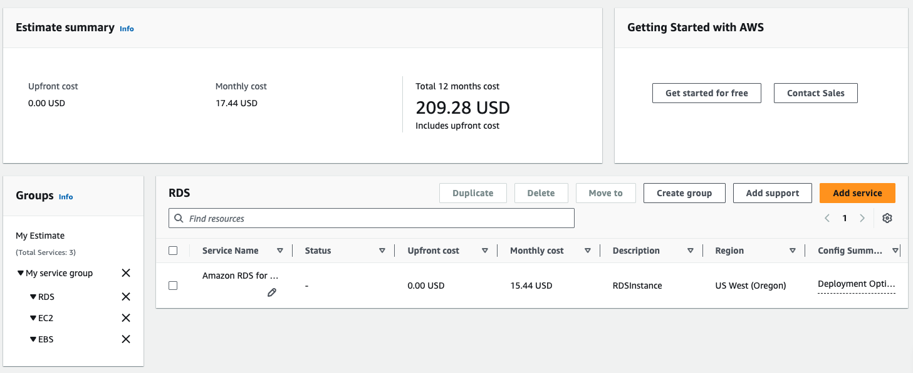

<a href="https://awyspr.com/"></a>

# Workload cost estimates from CloudFormation

2026-01-19

## What's this one all about then ?

Our recent fieldnote about deal sizing from estimates jogged our memory about an old feature which is worth revisiting: generating
estimates from CloudFormation workload definitions.

This was the hook:

``"Partners can optionally import AWS Pricing Calculator URLs to automatically populate AWS service selections
and corresponding spend estimates into their opportunities, reducing the need for manual re-entry.``

### Workload cost estimates from CloudFormation

This is actually a fairly old CLI/API, but its a goodie.

Essentially, if you have a CloudFormation definition of your workload, you can use that definition to bootstrap
the workload cost estimator. [The details](https://docs.aws.amazon.com/cli/latest/reference/cloudformation/estimate-template-cost.html) 
are tucked away in a place many alliance people will not know exists :-(

A worked example: if we have a Cloudformation yaml file like this (if you don't speak CloudFormation, scroll down to see the results!):

```
AWSTemplateFormatVersion: '2010-09-09'
Description: >
  Dev infrastructure stack - t3.micro EC2 + 20GB EBS (gp3) + RDS PostgreSQL (dev grade).
  Deploy this template once per target region:
    us-west-2 | ap-southeast-2 | eu-west-1
  Use StackSets or the CLI deploy commands at the bottom of this file.

# ─────────────────────────────────────────────
# PARAMETERS
# ─────────────────────────────────────────────
Parameters:

  EnvironmentName:
    Type: String
    Default: dev
    Description: Short prefix applied to all resource names and tags.

  KeyPairName:
    Type: AWS::EC2::KeyPair::KeyName
    Description: >
      Name of an existing EC2 Key Pair in this region for SSH access.
      Key Pairs are region-specific — you need one per region.

  DBPassword:
    Type: String
    NoEcho: true
    MinLength: 12
    MaxLength: 41
    AllowedPattern: '[a-zA-Z0-9!#$%^&*()_+=-]*'
    Description: >
      RDS master password (12-41 chars, alphanumeric + special chars).
      NoEcho prevents it appearing in console or CLI output.

  DBUsername:
    Type: String
    Default: dbadmin
    MinLength: 1
    MaxLength: 16
    AllowedPattern: '[a-zA-Z][a-zA-Z0-9]*'
    Description: RDS master username.

  AllowedSSHCidr:
    Type: String
    Default: 0.0.0.0/0
    Description: >
      CIDR block permitted SSH access to the EC2 instance.
      Restrict to your IP in practice (e.g. 203.0.113.0/32).

# ─────────────────────────────────────────────
# MAPPINGS
# Uses SSM dynamic resolution for AMI IDs so
# this template never needs updating for AMI
# changes — AWS resolves the latest AL2023 AMI
# in whatever region you deploy into.
# ─────────────────────────────────────────────
# No static AMI mappings needed — see ImageId below.

# ─────────────────────────────────────────────
# RESOURCES
# ─────────────────────────────────────────────
Resources:

  # ── NETWORKING ──────────────────────────────

  VPC:
    Type: AWS::EC2::VPC
    Properties:
      CidrBlock: 10.0.0.0/16
      EnableDnsSupport: true
      EnableDnsHostnames: true
      Tags:
        - Key: Name
          Value: !Sub ${EnvironmentName}-vpc

  InternetGateway:
    Type: AWS::EC2::InternetGateway
    Properties:
      Tags:
        - Key: Name
          Value: !Sub ${EnvironmentName}-igw

  IGWAttachment:
    Type: AWS::EC2::VPCGatewayAttachment
    Properties:
      VpcId: !Ref VPC
      InternetGatewayId: !Ref InternetGateway

  # Public subnet — EC2 lives here
  PublicSubnet:
    Type: AWS::EC2::Subnet
    Properties:
      VpcId: !Ref VPC
      CidrBlock: 10.0.1.0/24
      AvailabilityZone: !Select [ 0, !GetAZs '' ]
      MapPublicIpOnLaunch: true
      Tags:
        - Key: Name
          Value: !Sub ${EnvironmentName}-public-subnet-az1

  PublicRouteTable:
    Type: AWS::EC2::RouteTable
    Properties:
      VpcId: !Ref VPC
      Tags:
        - Key: Name
          Value: !Sub ${EnvironmentName}-public-rt

  PublicRoute:
    Type: AWS::EC2::Route
    DependsOn: IGWAttachment
    Properties:
      RouteTableId: !Ref PublicRouteTable
      DestinationCidrBlock: 0.0.0.0/0
      GatewayId: !Ref InternetGateway

  PublicSubnetRTAssociation:
    Type: AWS::EC2::SubnetRouteTableAssociation
    Properties:
      SubnetId: !Ref PublicSubnet
      RouteTableId: !Ref PublicRouteTable

  # Private subnets — RDS requires at least 2 AZs for a subnet group
  PrivateSubnetAZ1:
    Type: AWS::EC2::Subnet
    Properties:
      VpcId: !Ref VPC
      CidrBlock: 10.0.2.0/24
      AvailabilityZone: !Select [ 0, !GetAZs '' ]
      Tags:
        - Key: Name
          Value: !Sub ${EnvironmentName}-private-subnet-az1

  PrivateSubnetAZ2:
    Type: AWS::EC2::Subnet
    Properties:
      VpcId: !Ref VPC
      CidrBlock: 10.0.3.0/24
      AvailabilityZone: !Select [ 1, !GetAZs '' ]
      Tags:
        - Key: Name
          Value: !Sub ${EnvironmentName}-private-subnet-az2

  # ── SECURITY GROUPS ─────────────────────────

  EC2SecurityGroup:
    Type: AWS::EC2::SecurityGroup
    Properties:
      GroupDescription: EC2 dev instance — SSH inbound only
      VpcId: !Ref VPC
      SecurityGroupIngress:
        - Description: SSH
          IpProtocol: tcp
          FromPort: 22
          ToPort: 22
          CidrIp: !Ref AllowedSSHCidr
      SecurityGroupEgress:
        - Description: Allow all outbound
          IpProtocol: -1
          CidrIp: 0.0.0.0/0
      Tags:
        - Key: Name
          Value: !Sub ${EnvironmentName}-ec2-sg

  RDSSecurityGroup:
    Type: AWS::EC2::SecurityGroup
    Properties:
      GroupDescription: RDS dev instance — Postgres inbound from EC2 SG only
      VpcId: !Ref VPC
      SecurityGroupIngress:
        - Description: Postgres from EC2
          IpProtocol: tcp
          FromPort: 5432
          ToPort: 5432
          SourceSecurityGroupId: !Ref EC2SecurityGroup
      Tags:
        - Key: Name
          Value: !Sub ${EnvironmentName}-rds-sg

  # ── EC2 ─────────────────────────────────────

  EC2Instance:
    Type: AWS::EC2::Instance
    Properties:
      InstanceType: t3.micro
      # Resolves to the latest Amazon Linux 2023 AMI in whatever
      # region this stack is deployed into — no hardcoded AMI IDs.
      ImageId: !Sub '{{resolve:ssm:/aws/service/ami-amazon-linux-latest/al2023-ami-kernel-default-x86_64}}'
      KeyName: !Ref KeyPairName
      SubnetId: !Ref PublicSubnet
      SecurityGroupIds:
        - !Ref EC2SecurityGroup
      # Root volume — default 8GB, left as-is.
      # The 20GB data volume is attached separately below.
      BlockDeviceMappings:
        - DeviceName: /dev/xvda
          Ebs:
            VolumeType: gp3
            VolumeSize: 8
            DeleteOnTermination: true
      Tags:
        - Key: Name
          Value: !Sub ${EnvironmentName}-ec2
        - Key: Environment
          Value: !Ref EnvironmentName

  # ── EBS DATA VOLUME (20GB) ──────────────────
  # Attached as a secondary block device at /dev/xvdf.
  # After first boot you'll need to: mkfs, mount, and
  # optionally add to /etc/fstab for persistence.

  EBSDataVolume:
    Type: AWS::EC2::Volume
    DeletionPolicy: Snapshot        # Snapshot before delete — change to Delete if preferred
    Properties:
      AvailabilityZone: !GetAtt EC2Instance.AvailabilityZone
      Size: 20
      VolumeType: gp3
      Encrypted: true
      Tags:
        - Key: Name
          Value: !Sub ${EnvironmentName}-data-volume

  EBSVolumeAttachment:
    Type: AWS::EC2::VolumeAttachment
    Properties:
      InstanceId: !Ref EC2Instance
      VolumeId: !Ref EBSDataVolume
      Device: /dev/xvdf

  # ── RDS POSTGRES (DEV GRADE) ─────────────────
  # Dev configuration:
  #   - db.t3.micro
  #   - Single-AZ (no standby)
  #   - No automated backups (retention = 0)
  #   - Deletion protection OFF
  #   - DeletionPolicy: Delete (stack teardown removes the DB)
  # Do NOT use this config in production.

  RDSSubnetGroup:
    Type: AWS::RDS::DBSubnetGroup
    Properties:
      DBSubnetGroupDescription: !Sub ${EnvironmentName} dev RDS subnet group
      SubnetIds:
        - !Ref PrivateSubnetAZ1
        - !Ref PrivateSubnetAZ2
      Tags:
        - Key: Name
          Value: !Sub ${EnvironmentName}-rds-subnet-group

  RDSInstance:
    Type: AWS::RDS::DBInstance
    DeletionPolicy: Delete          # Stack delete drops the DB — intentional for dev
    UpdateReplacePolicy: Delete
    Properties:
      DBInstanceIdentifier: !Sub ${EnvironmentName}-postgres
      DBInstanceClass: db.t3.micro
      Engine: postgres
      EngineVersion: '16.3'         # Update to latest available if this errors on deploy
      MasterUsername: !Ref DBUsername
      MasterUserPassword: !Ref DBPassword
      AllocatedStorage: '20'
      StorageType: gp2
      MultiAZ: false                # Single-AZ — dev only
      PubliclyAccessible: false     # Accessible from EC2 via SG rule above
      DBSubnetGroupName: !Ref RDSSubnetGroup
      VPCSecurityGroups:
        - !Ref RDSSecurityGroup
      BackupRetentionPeriod: 0      # Disable automated backups — dev only
      DeletionProtection: false
      StorageEncrypted: true
      Tags:
        - Key: Name
          Value: !Sub ${EnvironmentName}-postgres
        - Key: Environment
          Value: !Ref EnvironmentName

# ─────────────────────────────────────────────
# OUTPUTS
# ─────────────────────────────────────────────
Outputs:

  VPCId:
    Description: VPC ID
    Value: !Ref VPC

  EC2InstanceId:
    Description: EC2 Instance ID
    Value: !Ref EC2Instance

  EC2PublicIP:
    Description: EC2 Public IP address
    Value: !GetAtt EC2Instance.PublicIp

  EBSVolumeId:
    Description: EBS data volume ID (mount at /dev/xvdf after first boot)
    Value: !Ref EBSDataVolume

  RDSEndpoint:
    Description: RDS Postgres endpoint hostname
    Value: !GetAtt RDSInstance.Endpoint.Address

  RDSPort:
    Description: RDS Postgres port
    Value: !GetAtt RDSInstance.Endpoint.Port
```

We can run it like this:

```
aws login
aws cloudformation estimate-template-cost \
  --region us-west-2 \
  --template-body file://devinfrasingle.yaml \
  --parameters \
    ParameterKey=KeyPairName,ParameterValue=your-keypair-name \
    ParameterKey=DBUsername,ParameterValue=dbadmin \
    ParameterKey=DBPassword,ParameterValue=YourSecurePassword123! \
    ParameterKey=AllowedSSHCidr,ParameterValue=0.0.0.0/0 \
    ParameterKey=EnvironmentName,ParameterValue=dev
```

And we get back [a result like this](https://calculator.aws/#/estimate?id=cloudformation/b317e025032ca5e4fb755c4d989429443126e2fb)



### Gotchas

Unfortunately the `estimate-template-cost` function works per region, so if you have a complex solution
with multi-region footprint you need to run the same process a few times with a different region each time. You can wrap it easily enough:

```
for REGION in us-west-2 ap-southeast-2 eu-west-1; do
  echo "=== $REGION ==="
  aws cloudformation estimate-template-cost \
    --region $REGION \
    --template-body file://devinframulti.yaml \
    --parameters \
      ParameterKey=KeyPairName,ParameterValue=your-keypair-name \
      ParameterKey=DBUsername,ParameterValue=dbadmin \
      ParameterKey=DBPassword,ParameterValue=YourSecurePassword123! \
      ParameterKey=AllowedSSHCidr,ParameterValue=0.0.0.0/0 \
      ParameterKey=EnvironmentName,ParameterValue=dev \
    --query 'Url' \
    --output text
done
```

In revisiting this we discovered there's a bug in the new PartnerCentral Estimator which means you
can't import CloudFormation-based Workload Cost Estimates from calculator.aws. We've reported it in detail
and presume it will be fixed eventually (it seems like this was a use case missed in testing).

## The wrap up

If you're working with a solution architect as you develop opportunities for customers, or if you're 
wondering what the cost will be for an internal project, there's an advantage to taking the CloudFormation
route that pays off twice - most people know that IaC = ability to deploy infrastructure from a script, repeatedly,
reliably. A smaller number know you can use the same script to work out the likely cost.

[Back to awyspr fieldnotes index](https://fieldnotes.awyspr.com)
